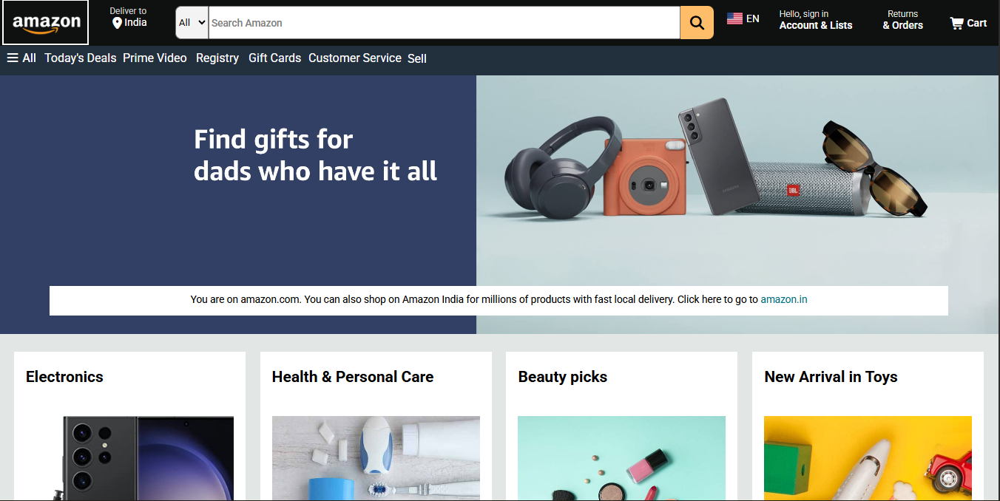
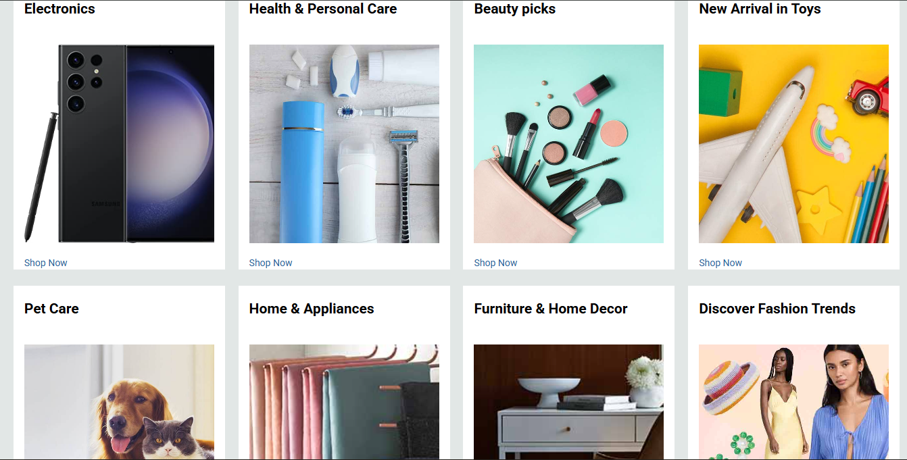
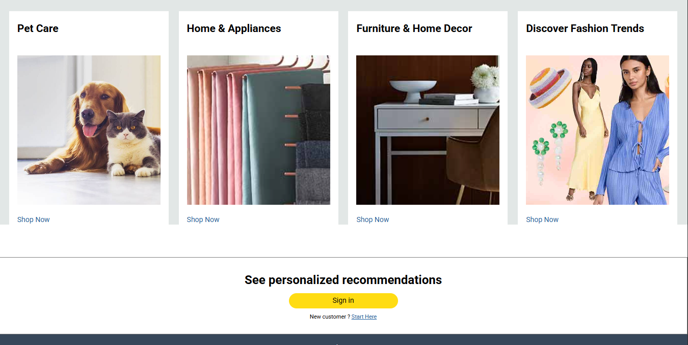
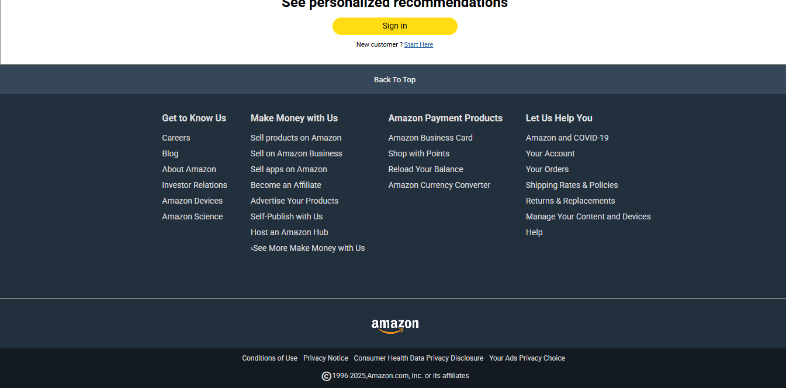

# 🛒 Amazon Clone (HTML + CSS)

## 📖 Overview

A fully responsive **Amazon homepage clone** built using **pure HTML and vanilla CSS**.  
This project replicates the visual design and layout of the original Amazon website, created to strengthen my front-end fundamentals — focusing on structure, styling, responsiveness, and component organization.

## 🚀 Features

- 🧩 Clean and minimal UI inspired by Amazon
- 🧭 Fully functional header with logo, search bar, and navigation links
- 🖼️ Hero banner with category-based call-to-action sections
- 🛍️ Product grid layout showcasing different product categories
- 📱 Responsive design that adapts seamlessly to all screen sizes
- 🦶 Footer with multi-column links and copyright info

## ⚙️ Built With

- **HTML5** — for semantic structure and accessibility
- **CSS3** — for styling, layout, animations, and responsiveness
  - Flexbox for alignment.
  - Grid for structured layouts.

## 📁 Folder Structure

```amazon-clone/
│
├── index.html
├── style.css
├── Assets/
│ ├── preview.png
└── README.md
```

## 📸 Preview






## 💡 My Learnings :

- Building structured layouts with **Flexbox** and **Grid**
- Writing **reusable CSS classes** for consistent styling
- Using **media queries** for mobile-first responsive design
- Understanding how to recreate complex websites using only HTML + CSS.

## 🧠 Future Enhancements

- Add **JavaScript functionality** for cart and navigation
- Integrate **API-driven product listings**
- Improve **animation and transition effects**

## 🙌 Acknowledgments

This project was inspired by the original Amazon website and created purely for educational and practice purposes.
