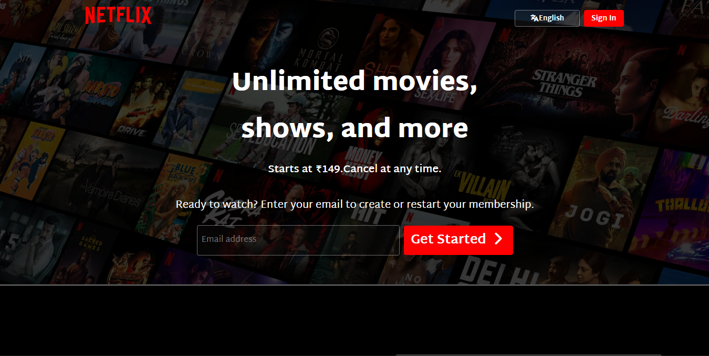
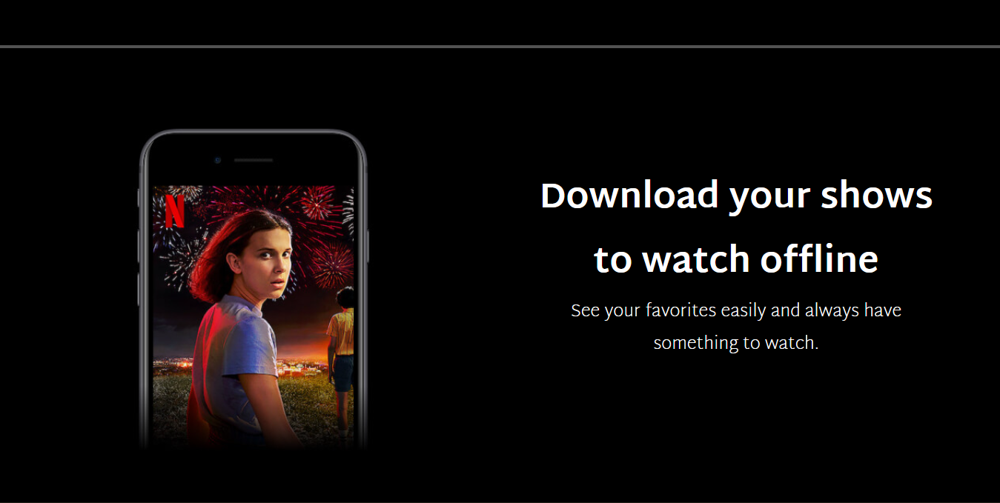
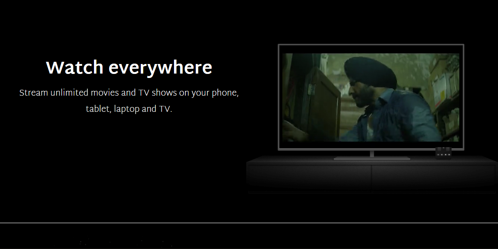
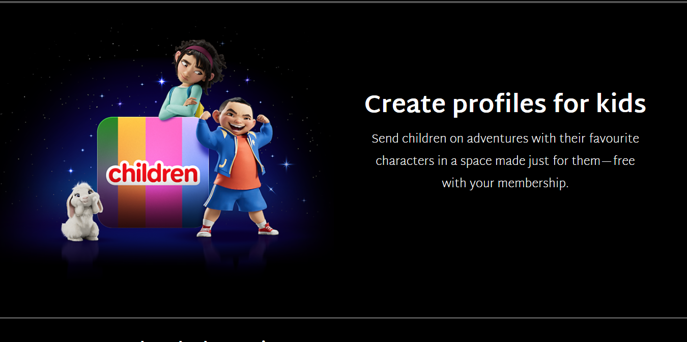
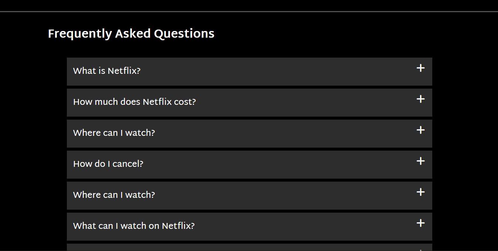
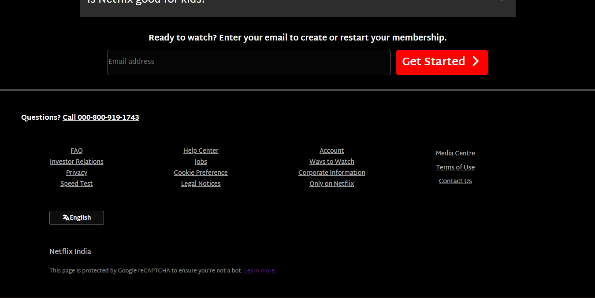

# 🎬Netflix UI Clone

A clean and responsive Netflix User Interface Clone built with **HTML** and **Vanilla CSS**. The design uses Google Fonts for typography and Font Awesome for icons. This project recreates the modern Netflix landing screen with a focus on layout, spacing, color palette, and attention to UI detail.

## 🚀 Features

- Clean Netflix-style hero section
- Navigation bar with logo, language selector, and sign-in button
- Movie/show content rows with thumbnails
- Google Fonts + Font Awesome integration
- Polished UI with Netflix-inspired colors and layout

## 🛠️ Technologies Used

- HTML5
- CSS3 (Vanilla CSS – no frameworks)
- Google Fonts (for typography)
- Font Awesome (for icons)

## 📁 Folder Structure

```Netflix UI Clone/
│
├── index.html
├── style.css
├── Assets/
│ ├── Preview/
└── README.md
```

## 📸 Preview








## 🔮 Future Enhancements

- Add full responsiveness for all screen sizes
- Implement functional carousels using JavaScript
- Add hover animations and interactive elements
- Improve accessibility and SEO

## 🧠 Learning Outcomes

- Improved understanding of layout structuring using HTML5
- Practiced advanced CSS styling techniques
- Learned to work with Google Fonts and Font Awesome
- Enhanced UI design skills by replicating a real-world product
