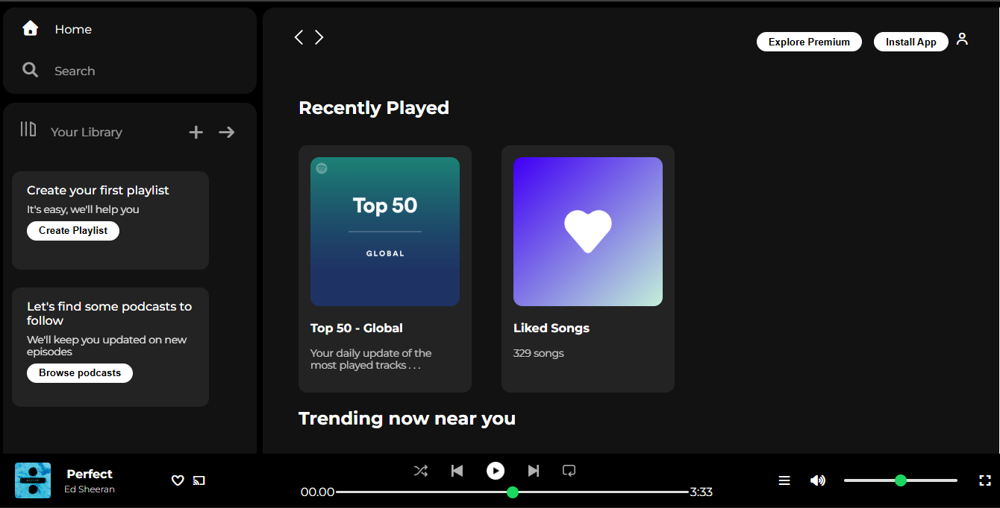

# 🎵 Spotify Clone (HTML + CSS)

## 📖 Overview

This is a fully responsive **Spotify landing page** clone built using pure **HTML** and **vanilla CSS**.
The goal of this project was to replicate the UI and layout of the Amazon homepage while strengthening my front-end fundamentals — focusing on structure, styling, and component organization without using any frameworks or libraries.

## 🚀 Features

- 🧩 Clean UI layout inspired by Amazon’s homepage
- 📦 Header with navigation bar, logo, and search bar
- 🖼️ Hero section with banner image
- 🛍️ Product grid showcasing multiple categories
- 📱 Responsive design (works across devices)
- 🦶 Footer section with site info and links

## 🛠️ Built With

- HTML5 – for structure and semantic layout
- CSS3 – for styling, layout, and responsiveness (Flexbox + Grid)

## 📁 Folder Structure

```spotify-clone/
│
├── index.html
├── style.css
└── Assets/
```

## 💡 Learning Highlights

- Improved page layout and section alignment using **Flexbox** and **Grid**.
- Practiced building pixel-perfect UIs without any external frameworks.
- Learned how to structure reusable components like navbars, product cards, and footers.

## 📸 Preview



## 🙌 Acknowledgments

This project was inspired by the original Amazon website and created purely for educational and practice purposes.
